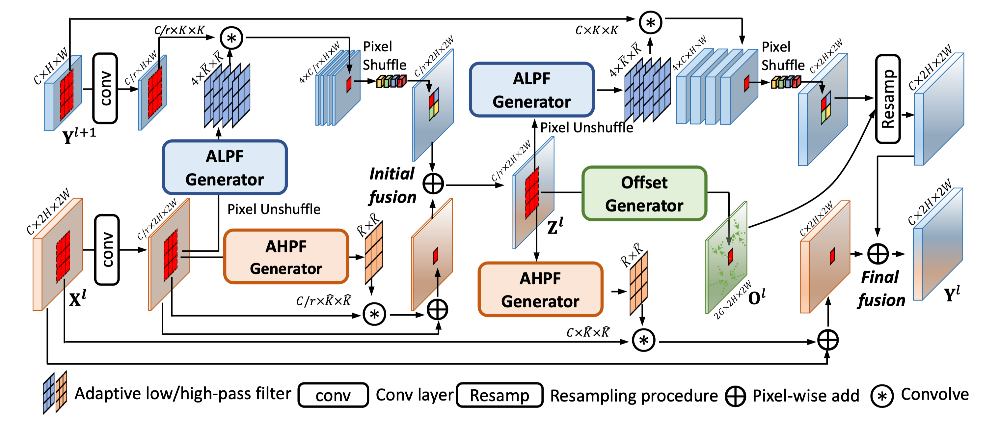

# FreqFusion

TPAMI 2024：Frequency-aware Feature Fusion for Dense Image Prediction

The preliminary [official implementation](https://github.com/Linwei-Chen/FreqFusion) of our TPAMI 2024 paper "[Frequency-aware Feature Fusion for Dense Image Prediction](https://www.arxiv.org/abs/2408.12879)", which is also available at https://github.com/ying-fu/FreqFusion.

Interested readers are also referred to an insightful [Note]() about this work in Zhihu (TODO). 

**Abstract**

Dense image prediction tasks demand features with strong category information and precise spatial boundary details at high resolution. To achieve this, modern hierarchical models often utilize feature fusion, directly adding upsampled coarse features from deep layers and high-resolution features from lower levels. In this paper, we observe rapid variations in fused feature values within objects, resulting in intra-category inconsistency due to disturbed high-frequency features. Additionally, blurred boundaries in fused features lack accurate high frequency, leading to boundary displacement. Building upon these observations, we propose Frequency-Aware Feature Fusion (FreqFusion), integrating an Adaptive Low-Pass Filter (ALPF) generator, an offset generator, and an Adaptive High-Pass Filter (AHPF) generator. The ALPF generator predicts spatially-variant low-pass filters to attenuate high-frequency components within objects, reducing intra-class inconsistency during upsampling. The offset generator refines large inconsistent features and thin boundaries by replacing inconsistent features with more consistent ones through resampling, while the AHPF generator enhances high-frequency detailed boundary information lost during downsampling. Comprehensive visualization and quantitative analysis demonstrate that FreqFusion effectively improves feature consistency and sharpens object boundaries. Extensive experiments across various dense prediction tasks confirm its effectiveness.


## Highlight✨

- We identify two significant issues present in widely-used standard feature fusion techniques: intra-category inconsistency and boundary displacement. We also introduce feature similarity analysis to quantitatively measure these issues, which not only contributes to the development of new feature fusion methods but also has the potential to inspire advancements in related areas and beyond.
- We propose FreqFusion, which addresses category inconsistency and boundary displacement by adaptively smoothing the high-level feature with spatial-variant low-pass filters, resampling nearby category-consistent features to replace inconsistent features in the high-level feature, and enhancing the high frequency of lower-level features.
- Qualitative and quantitative results demonstrate that FreqFusion increases intra-category similarity and similarity margin, leading to a consistent and considerable improvement across various tasks, including semantic segmentation, object detection, instance segmentation, and panoptic segmentation.


## Method Overview💡




## Visualization👀


## FreqFusion Usage

The clean code for **FreqFusion** is available [here](https://github.com/Linwei-Chen/FreqFusion/blob/main/FreqFusion.py). By utilizing their frequency properties, **FreqFusion** is capable of enhancing the quality of both low and high-resolution features (referred to as `lr_feat` and `hr_feat`, respectively, with the assumption that the size of `hr_feat` is twice that of `lr_feat`). The usage is very simple.

```python
m = FreqFusion(hr_channels=64, lr_channels=64)
hr_feat = torch.rand(1, 64, 32, 32)
lr_feat = torch.rand(1, 64, 16, 16)
_, hr_feat, lr_feat = m(hr_feat=hr_feat, lr_feat=lr_feat) # lr_feat [1, 64, 32, 32]
```

**Where should I integrate FreqFusion?**

You should integrate FreqFusion wherever you need to perform upsampling. FreqFusion is capable of fully utilizing both low and high-resolution features, it can very effectively recover high-resolution, semantically accurate features from low-resolution high-level features, while enhancing the details of high-resolution low-level features.

The **FreqFusion** relies on mmcv libarary, you can install mmcv-full by: 

```
pip install torch==1.11.0+cu113 torchvision==0.12.0+cu113 -f https://download.pytorch.org/whl/torch_stable.html
pip install mmcv-full==1.5.3 -f https://download.openmmlab.com/mmcv/dist/cu113/torch1.11/index.html
```

You can refer to https://mmcv.readthedocs.io/en/v1.7.0/get_started/installation.html and select the appropriate installation command depending on the type of system, CUDA version, PyTorch version, and MMCV version.

**Tips:**

MMData installation may be annoying, and although the adaptive low/high-filter in FreqFusion can use `torch.nn.functional.unfold` as a replacement (you can try), it may consume a large amount of GPU memory. Therefore, I suggest using MMData for efficiency.

### Semantic Segmentation

#### SegNeXt

Code of [SegNeXt](./SegNeXt)

Core modification: 

[FreqFusion.py](./FreqFusion/SegNeXt/mmseg/models/decode_heads/FreqFusion.py)

[ham_head.py](./SegNeXt/mmseg/models/decode_heads/ham_head.py)

| Method               | Backbone | Crop Size | Lr Schd | mIoU     |
| -------------------- | -------- | --------- | ------- | -------- |
| SegNeXt              | MSCAN-T  | 512x512   | 160k    | 41.1     |
| SegNeXt + FreqFusion | MSCAN-T  | 512x512   | 160k    | **43.5** |

Checkpoint:

| Method               | Backbone | mIoU                     | Configs                                                      | Links                                                        |
| -------------------- | -------- | ------------------------ | ------------------------------------------------------------ | ------------------------------------------------------------ |
| SegNeXt + FreqFusion | MSCAN-T  | **43.7** (43.5 in paper) | [config](./SegNeXt/local_configs/segnext/tiny/segnext.tiny.freqfusion.512x512.ade.160k.py) | [ckpt](https://pan.baidu.com/s/12rqBsLDS4bPqePvjmpBLEQ?pwd=PAMI) (code: PAMI) |

Note:

The original SegNeXt code can be found [here](https://github.com/Visual-Attention-Network/SegNeXt).

Our code is based on [MMSegmentation](https://github.com/open-mmlab/mmsegmentation). You can install mmseg by:

```
pip install mmsegmentation==0.24.1
```

Please refer to [get_started.md](https://github.com/open-mmlab/mmsegmentation/blob/main/docs/en/get_started.md#installation) for more details on installation, and [dataset_prepare.md](https://github.com/open-mmlab/mmsegmentation/blob/main/docs/en/user_guides/2_dataset_prepare.md#prepare-datasets) for information on dataset preparation. For further details on code usage, you can refer to [this](https://github.com/raoyongming/HorNet/tree/master/semantic_segmentation).

You can install mmcv-full by: 

```
pip install torch==1.11.0+cu113 torchvision==0.12.0+cu113 -f https://download.pytorch.org/whl/torch_stable.html
pip install mmcv-full==1.5.3 -f https://download.openmmlab.com/mmcv/dist/cu113/torch1.11/index.html
```

For more details on installing and using SegNeXt, please refer to the [README](./SegNeXt/README.md) file.


#### Mask2Former

[Code of Mask2Former](./Mask2Former)

Core modification: 

[FreqFusion.py](./Mask2Former/mask2former/modeling/pixel_decoder/FreqFusion.py)

[msdeformattn.py](./Mask2Former/mask2former/modeling/pixel_decoder/msdeformattn.py)

| Mask2Former           | Backbone | mIoU            |
| --------------------- | -------- | --------------- |
| Bilinear              | Swin-B   | 53.9            |
| **FreqFusion (Ours)** | Swin-B   | **55.3 (+1.4)** |
| Bilinear              | Swin-L   | 56.1            |
| **FreqFusion (Ours)** | Swin-L   | **56.8 (+0.7)** |


Checkpoint:

| Mask2Former | Backbone | mIoU            | Configs | Links |
| ---------------------- | -------- | --------------- | ---------------------- | ---------------------- |
| **FreqFusion**  | Swin-B   | **55.7** (55.3 in paper) | [config](./Mask2Former/configs/ade20k/semantic-segmentation/swin/maskformer2_FreqAware_swin_base_IN21k_384_bs16_160k_res640.yaml) | [ckpt](https://pan.baidu.com/s/1wRAwAUsGT3S0MEWhPGeguA?pwd=PAMI) (code: PAMI) |
| **FreqFusion**  | Swin-L   | **57.0** (56.8 in paper) | [config](./Mask2Former/configs/ade20k/semantic-segmentation/swin/maskformer2_FreqAware_swin_large_IN21k_384_bs16_160k_res640.yaml) |  [ckpt](https://pan.baidu.com/s/1EXqVl99hn6YYPeeEnT_gXQ?pwd=PAMI) (code: PAMI)|


Note：

Install [Mask2Former](https://github.com/facebookresearch/Mask2Former?tab=readme-ov-file).

See [Preparing Datasets for Mask2Former](https://github.com/facebookresearch/Mask2Former/blob/main/datasets/README.md).

See [Getting Started with Mask2Former](https://github.com/facebookresearch/Mask2Former/blob/main/GETTING_STARTED.md).

See [installation instructions](https://github.com/facebookresearch/Mask2Former/blob/main/INSTALL.md).

For more details on installing and using Mask2Former, please refer to the [README](./Mask2Former/README.md) file.


### Object Detection

Code for Faster R-CNN, Mask R-CNN, Panoptic FPN: [Here](./mmdetection) (mmdet==2.28.1)

| Faster R-CNN（Detection） | Backbone | AP       |
| ------------------------- | -------- | -------- |
| Nearest                   | R50      | 37.5     |
| Deconv                    | R50      | 37.3     |
| PixelShuffle              | R50      | 37.5     |
| CARAFE                    | R50      | 38.6     |
| IndexNet                  | R50      | 37.6     |
| A2U                       | R50      | 37.3     |
| FADE                      | R50      | 38.5     |
| SAPA-B                    | R50      | 37.8     |
| DySample-S+               | R50      | 38.6     |
| DySample+                 | R50      | 38.7     |
| **FreqFusion (Ours)**     | R50      | **39.4** |
| Nearest                   | *R101*   | 39.4     |
| DySample+                 | *R101*   | 40.5     |
| **FreqFusion (Ours)**     | *R101*   | **41.0** |

Checkpoint:

| Faster R-CNN   | Backbone   | Box AP                   | Configs                                                      | Links                                                        |
| -------------- | ---------- | ------------------------ | ------------------------------------------------------------ | ------------------------------------------------------------ |
| **FreqFusion** | ResNet-50  | **39.5** (39.4 in paper) | [config](./mmdetection/configs/faster_rcnn/faster_rcnn_r50_fpn_1x_coco_freqfusion.py) | [ckpt](https://pan.baidu.com/s/1b8J0E5RCSXEVNkF-hnTfNA?pwd=PAMI) (code: PAMI) |
| **FreqFusion** | ResNet-101 | **41.1** (41.0 in paper) | [config](./mmdetection/configs/faster_rcnn/faster_rcnn_r101_fpn_1x_coco_freqfusion.py) | [ckpt](https://pan.baidu.com/s/1hGqON9ma4XgZKHZ0HJ8z1w?pwd=PAMI) (code: PAMI) |


### **Instance Segmentation**

| Model                 | Backbone | Box AP   | Mask AP  |
| --------------------- | -------- | -------- | -------- |
| Nearest               | R50      | 38.3     | 34.7     |
| Deconv                | R50      | 37.9     | 34.5     |
| PixelShuffle          | R50      | 38.5     | 34.8     |
| CARAFE                | R50      | 39.2     | 35.4     |
| IndexNet              | R50      | 38.4     | 34.7     |
| A2U                   | R50      | 38.2     | 34.6     |
| FADE                  | R50      | 39.1     | 35.1     |
| SAPA-B                | R50      | 38.7     | 35.1     |
| DySample-S+           | R50      | 39.3     | 35.5     |
| DySample+             | R50      | 39.6     | 35.7     |
| **FreqFusion (Ours)** | R50      | **40.0** | **36.0** |
| Nearest               | *R101*   | 40.0     | 36.0     |
| DySample+             | *R101*   | 41.0     | 36.8     |
| **FreqFusion (Ours)** | *R101*   | **41.6** | **37.4** |


Checkpoint:

| Mask R-CNN     | Backbone  | Mask AP  | Configs                                                      | Links                                                        |
| -------------- | --------- | -------- | ------------------------------------------------------------ | ------------------------------------------------------------ |
| **FreqFusion** | ResNet-50 | **36.0** | [config](./mmdetection/configs/mask_rcnn/mask_rcnn_r50_fpn_1x_coco_freqfusion.py) | [ckpt](https://pan.baidu.com/s/1nghqP5itCInttxIk15oqjA?pwd=PAMI) (code: PAMI) |
| **FreqFusion** | ResNet-50 | **37.3** | [config](./mmdetection/configs/mask_rcnn/mask_rcnn_r101_fpn_1x_coco_freqfusion.py) | [ckpt](https://pan.baidu.com/s/1z_Q6ynzylE2E59Lug46izg?pwd=PAMI) (code: PAMI) |


### **Panoptic Segmentation**

| Panoptic FPN          | Backbone | Params (M) | PQ       | PQ<sup>th</sup> | PQ<sup>st</sup> | SQ       | RQ       |
| --------------------- | -------- | ---------- | -------- | --------------- | --------------- | -------- | -------- |
| Nearest               | R50      | 46.0       | 40.2     | 47.8            | 28.9            | 77.8     | 49.3     |
| Deconv                | R50      | +1.8       | 39.6     | 47.0            | 28.4            | 77.1     | 48.5     |
| PixelShuffle          | R50      | +7.1       | 40.0     | 47.4            | 28.8            | 77.1     | 49.1     |
| CARAFE                | R50      | +0.2       | 40.8     | 47.7            | 30.4            | 78.2     | 50.0     |
| IndexNet              | R50      | +6.3       | 40.2     | 47.6            | 28.9            | 77.1     | 49.3     |
| A2U                   | R50      | +29.2K     | 40.1     | 47.6            | 28.7            | 77.3     | 48.0     |
| FADE                  | R50      | +0.1       | 40.9     | 48.0            | 30.3            | 78.1     | 50.1     |
| SAPA-B                | R50      | +0.1       | 40.6     | 47.7            | 29.8            | 78.0     | 49.6     |
| DySample-S+           | R50      | +6.2K      | 41.1     | 48.1            | 30.5            | 78.2     | 50.2     |
| DySample+             | R50      | +49.2K     | 41.5     | 48.5            | 30.8            | 78.3     | 50.7     |
| **FreqFusion** (Ours) | R50      | +0.3       | **42.7** | **49.3**        | **32.7**        | **79.0** | **51.9** |
| Nearest               | *R101*   | 65.0       | 42.2     | 50.1            | 30.3            | 78.3     | 51.4     |
| DySample+             | *R101*   | +49.2K     | 43.0     | 50.2            | 32.1            | 78.6     | 52.4     |
| **FreqFusion** (Ours) | *R101*   | +0.3       | **44.0** | **50.8**        | **33.7**        | **79.4** | **53.4** |


Checkpoint:

| Panoptic FPN   | Backbone  | PQ                       | Configs                                                      | Links                                                        |
| -------------- | --------- | ------------------------ | ------------------------------------------------------------ | ------------------------------------------------------------ |
| **FreqFusion** | ResNet-50 | **42.7**                 | [config](./mmdetection/configs/panoptic_fpn/panoptic_fpn_r50_fpn_1x_coco_freqfusion.py) | [ckpt](https://pan.baidu.com/s/1wkMt75sT9UoRc9ymBrj93g?pwd=PAMI) (code: PAMI) |
| **FreqFusion** | ResNet-50 | **44.1** (44.0 in paper) | [config](./mmdetection/configs/panoptic_fpn/panoptic_fpn_r101_fpn_1x_coco_freqfusion.py) | [ckpt](https://pan.baidu.com/s/1OIRWPNALwqf5DtKGt2RoYA?pwd=PAMI) (code: PAMI) |


Note:

Original code of mmdet can be found [here](https://github.com/open-mmlab/mmdetection/tree/dev-2.x).

For more details on installing and using mmdetection, please refer to the [README](./mmdetection/README.md) file.

## Citation

If you use our dataset or code for research, please cite this paper (early access now): 

```
@ARTICLE{2024freqfusion,
  author={Chen, Linwei and Fu, Ying and Gu, Lin and Yan, Chenggang and Harada, Tatsuya and Huang, Gao},
  journal={IEEE Transactions on Pattern Analysis and Machine Intelligence}, 
  title={Frequency-aware Feature Fusion for Dense Image Prediction}, 
  year={2024},
  volume={1},
  number={1},
  pages={1-18},
  doi={10.1109/TPAMI.2024.3449959}}
```

## Acknowledgment

This code is built using [mmsegmentation](https://github.com/open-mmlab/mmsegmentation), [Mask2Former](https://github.com/facebookresearch/Mask2Former), [mmdetection](https://github.com/open-mmlab/mmdetection/tree/dev-2.x) libraries.

## Contact

If you encounter any problems or bugs, please don't hesitate to contact me at [chenlinwei@bit.edu.cn](mailto:chenlinwei@bit.edu.cn). To ensure effective assistance, please provide a brief self-introduction, including your name, affiliation, and position. If you would like more in-depth help, feel free to provide additional information such as your personal website link. I would be happy to discuss with you and offer support.